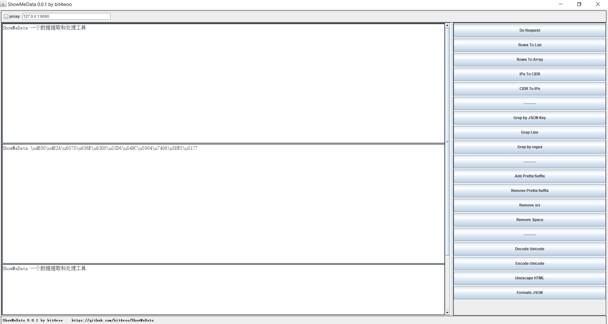

# ShowMeData

[ShowMeData](https://github.com/bit4woo/ShowMeData) 数据提取和处理工具 by [bit4woo](https://github.com/bit4woo)



## 功能解释

### 数据获取

Do Request： 发送HTTP请求

### 数据格式转换

Rows To List： 将行转换为Python中List的格式，每行是一个数组元素 

```
aaaa
bbb
cccc

[aaaa, bbb, cccc]
```

Rows To Array： 将行转换为Java中的数组的格式 

```
aaaa
bbb
cccc

{"aaaa","bbb","cccc"}
```

IPs To CIDR： IP地址列表转换成网段

CIDR To IPs： 网段列表转换成IP地址列表


### 数据提取过滤

Grep by JSON Key： 遍历JSON中的所有元素，根据Key值提取所有Value

Grep Line： 遍历每一行，如果包含指定的字符串则提取

```
baidu
jd
alibaba

提取包含“b”的行：

baidu
alibaba
```

Grep by regex：  遍历每一行，根据正则表达式提取


### 新增或删除特定字符

Add Prefix/Suffix： 给每一行添加前缀和后缀

```
baidu
jd
alibaba

http://baidu.com
http://jd.com
http://alibaba.com
```

Remove Prefix/Suffix：删除每行的前缀和后缀

Remove \\n\\r：移除文本中的所有换行符

```
baidu
jd
alibaba

baidujdalibaba
```

Remove Space：移除文本中的所有空格字符

```
bai   du
j d
ali   baba


baidu
jd
alibaba
```


### 易读处理、格式美化

Decode Unicode： unicode解码

```
中文

\u4E2D\u6587
```

Encode Unicode： unicode解码

```
\u4E2D\u6587

中文
```

Unescape HTML： HTML编码解码

Formate JSON：JSON格式化